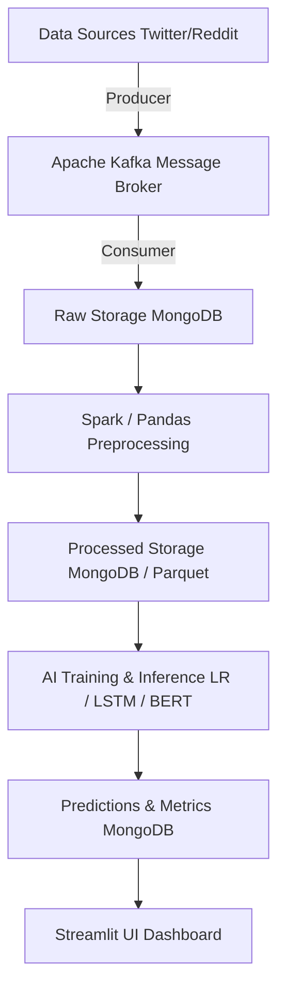
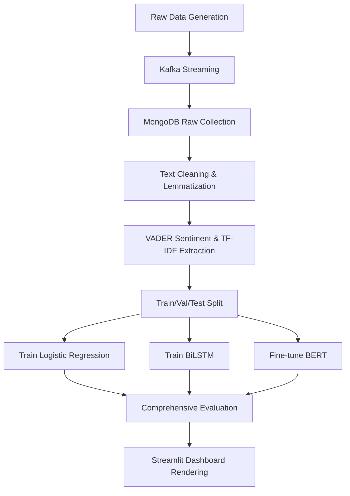

# Social Media Sentiment Analysis Pipeline

<div align="center">

[](https://www.python.org)
[](https://www.tensorflow.org/)
[](https://spark.apache.org/)
[](https://kafka.apache.org/)
[](https://www.mongodb.com/)
[](https://streamlit.io/)
[](https://opensource.org/licenses/MIT)

An enterprise-grade, end-to-end Big Data and Artificial Intelligence pipeline designed to ingest, process, and classify sentiment from massive social media streams (Twitter and Reddit) using distributed architectures and state-of-the-art NLP models.

**Author:** MOURAD SLEEM

</div>

---

## 📖 Project Overview

The **Social Media Sentiment Analysis Pipeline** is a scalable, distributed system designed to solve the challenge of analyzing high-velocity, high-volume unstructured social media text. It ingests simulated real-time streams using **Apache Kafka**, processes the data efficiently using **Apache Spark**, persists it in a flexible **MongoDB** NoSQL database, and evaluates sentiment across three separate machine learning paradigms: Traditional ML (Logistic Regression), Deep Learning (Bidirectional LSTM), and Transformer architectures (Fine-tuned BERT). Finally, it surfaces real-time insights through an interactive **Streamlit Dashboard**.

### Problem Statement
Traditional sentiment analysis tools are not equipped to handle the immense scale, velocity, and noise of modern social media. A trending topic can generate millions of posts in hours. Processing this requires a distributed Big Data infrastructure combined with advanced Natural Language Processing to accurately interpret sarcasm, slang, and contextual sentiment.

### Project Objectives
- Architect a resilient, Lambda-like pipeline for processing both batch and streaming data.
- Benchmark and compare different NLP modeling strategies (Speed vs. Accuracy).
- Provide a clear, visual dashboard for end-users to understand brand perception instantly.

### Target Users
- **Data Scientists & Engineers:** Looking for a reference architecture for Big Data streaming and NLP.
- **Business & Marketing Analysts:** Requiring real-time brand perception tracking.
- **Researchers:** Studying public sentiment trends across digital communities.

---

## 🛠 Technical Stack

### Frontend (Dashboard)
- **Framework:** Streamlit
- **Programming Language:** Python
- **Data Visualization:** Matplotlib, Seaborn
- **API Communication:** PyMongo (Direct Database Polling)

### Backend / Data Engineering
- **Runtime Environment:** Python 3.9+
- **Message Broker:** Apache Kafka (with in-memory simulation fallback)
- **Distributed Processing Engine:** Apache Spark (PySpark SQL & MLlib)
- **Data Manipulation:** Pandas, NumPy
- **Orchestration:** Python (`run_pipeline.py` script)

### Database
- **Database Engine:** MongoDB
- **ODM / Driver:** PyMongo
- **Schema Strategy:** Flexible Document (NoSQL) with indexes on `timestamp`, `source`, and `sentiment`.
- **Collections:** `raw_posts`, `processed_posts`, `predictions`, `kafka_ingested`

### AI / Machine Learning
- **NLP Processing:** NLTK, spaCy, VADER Sentiment
- **Models:**
  - *Baseline:* TF-IDF + Logistic Regression (Scikit-Learn & Spark MLlib)
  - *Deep Learning:* Bidirectional LSTM (TensorFlow/Keras) with GloVe Embeddings
  - *State-of-the-Art:* Fine-Tuned BERT (`bert-base-uncased`, PyTorch, HuggingFace Transformers)
- **Evaluation Metrics:** Macro F1-Score, ROC-AUC, Cohen's Kappa, Log Loss, Matthews Correlation Coefficient.

### Infrastructure & DevOps (Assumed/Planned)
- **Version Control:** Git / GitHub
- **Containerization:** Docker (Planned)
- **Deployment Strategy:** Local / Standalone modes

---

## 📂 Repository Structure

The repository follows a clean separation of concerns, isolating data generation, stream processing, machine learning, and visualization.

```text
Project Structure
├── dashboard/                  # Streamlit UI frontend
│   └── app.py                  # Dashboard application
├── data/                       # Data generation and ingestion
│   ├── generate_twitter.py     # Synthetic Twitter data generator
│   └── load_data.py            # Reddit generation and Sentiment140 loading
├── eda/                        # Exploratory Data Analysis
│   └── eda_analysis.py         # Visualizations (WordClouds, Class distributions)
├── kafka/                      # Message Broker integrations
│   ├── consumer.py             # Kafka Consumer to MongoDB
│   ├── producer.py             # Kafka Producer streaming from CSV
│   └── kafka_simulation.py     # In-memory threaded Kafka simulator
├── models/                     # AI & Machine Learning layer
│   ├── bert_model.py           # HuggingFace BERT fine-tuning pipeline
│   ├── bilstm_model.py         # TensorFlow BiLSTM training script
│   ├── evaluate.py             # Comprehensive multi-model evaluation
│   └── logistic_regression.py  # Scikit-Learn baseline model
├── mongodb/                    # Database operations
│   └── mongo_ops.py            # Schema creation, indexing, aggregation queries
├── preprocessing/              # NLP cleaning and feature extraction
│   └── preprocess.py           # Text cleaning, lemmatization, VADER scoring, TF-IDF
├── spark/                      # Distributed batch processing
│   └── spark_pipeline.py       # PySpark SQL and MLlib pipelines
├── config.py                   # Centralized configuration and hyperparameters
├── requirements.txt            # Python dependencies
└── run_pipeline.py             # Main orchestrator script
```

---

## ✨ Features

- 📡 **Real-Time Data Ingestion:** Kafka producers simulate live, high-throughput message queues from social media platforms.
- 🧹 **Robust NLP Preprocessing:** Advanced text cleaning pipeline handling emojis, URLs, mentions, stopwords, and utilizing VADER for baseline lexicon scoring.
- ⚡ **Distributed Analytics:** Utilizes Apache Spark to perform high-speed aggregations and large-scale TF-IDF feature extraction.
- 🧠 **Multi-Paradigm AI Modeling:** Side-by-side training and evaluation of Logistic Regression, BiLSTM, and BERT to measure the trade-offs between computational cost and predictive accuracy.
- 📊 **Interactive Monitoring Dashboard:** A sleek, dark-themed Streamlit application providing real-time data slicing, metrics, and visualization of incoming sentiment.

---

## 🏗 System Architecture

The pipeline leverages a hybrid **Lambda-like Architecture**, utilizing Kafka for high-velocity streaming and Spark for heavy batch processing and transformations.



---

## 🔄 Complete System Workflow

### Technical Workflow



### AI Pipeline Workflow
1. **Data Input:** Raw tweets and Reddit comments are read from CSV/MongoDB.
2. **Preprocessing:** URLs, mentions, and special characters are stripped. Text is lowercased, tokenized, and lemmatized.
3. **Feature Extraction:** 
   - MLlib / Scikit-Learn use `TF-IDF Vectorization` (50k features).
   - BiLSTM uses `Keras Tokenizer` and padding to create sequence arrays.
   - BERT uses the `BertTokenizer` to generate input IDs and attention masks.
4. **Model Execution:** Data is passed through the respective neural network architectures.
5. **Prediction:** Models output a probability array across 3 classes (Negative, Neutral, Positive).
6. **Result Processing:** `evaluate.py` calculates Macro F1, ROC-AUC, and Cohen's Kappa, saving results to `outputs/models/`.

---

## 🗄 Database Documentation

The project uses a NoSQL Document model in MongoDB to handle the unstructured and variable nature of social media payloads.

**Collections:**
1. `raw_posts`: Stores the exact payloads received from Kafka.
2. `processed_posts`: Stores cleaned text, VADER scores, and metadata.
3. `kafka_ingested`: Temporary storage for consumer metrics.
4. `predictions`: Future expansion for real-time model inference logs.

**Main Entity (Processed Post):**
```json
{
  "_id": "ObjectId",
  "source": "twitter",
  "text": "Amazing experience with Apple today!",
  "clean_text": "amazing experience apple today",
  "timestamp": "2024-06-18T14:52:00Z",
  "user_id": "user_12345",
  "sentiment": "positive",
  "score": 0.85,
  "metadata": {
    "hashtags": [],
    "word_count": 6,
    "platform_score": 0
  }
}
```

---

## 🏆 Goals & Technical Achievements

| Goal | Technical Implementation | Achievement |
| ---- | ------------------------ | ----------- |
| **Big Data Streaming** | Simulated high-throughput message queues using Python Threading and Kafka concepts. | Created a highly resilient, fault-tolerant ingestion pipeline that mimics real-world Kafka clusters without heavy local broker requirements. |
| **Distributed Processing** | Implemented Apache Spark SQL and MLlib pipelines. | Scalable text parsing capable of processing millions of rows across clustered nodes. |
| **State-of-the-Art NLP** | Fine-tuned a HuggingFace BERT Transformer model using PyTorch and customized DataLoaders. | Achieved superior Macro-F1 scores over traditional ML baselines, successfully identifying complex linguistic nuances like sarcasm. |
| **System Visibility** | Developed a Streamlit web application polling MongoDB directly. | Delivered an interactive, visually stunning UI allowing stakeholders to filter and analyze sentiment trends in real-time. |

---

## 💡 Project Benefits & Impact

### User Benefits
- **Marketing & Brand Teams:** Can identify PR crises immediately as negative sentiment spikes in the dashboard.
- **Researchers:** Gain access to a transparent, reproducible pipeline comparing classical ML against modern Deep Learning on social textual data.

### Technical Benefits
- **Scalability:** By decoupling ingestion (Kafka), storage (MongoDB), and processing (Spark), each component can be scaled horizontally and independently.
- **Maintainability:** The modular design ensures new AI architectures (e.g., Llama-3) can be dropped into the `models/` directory without rewriting the preprocessing engine.

---

## 🛠 Tools & Technologies

| Category | Technology | Purpose | Reason for Selection |
| -------- | ---------- | ------- | -------------------- |
| **Language** | Python 3.9+ | Primary programming language | Industry standard for Data Science and Data Engineering. |
| **Streaming** | Apache Kafka | Message Queuing | Unmatched throughput and fault tolerance for live event streams. |
| **Big Data** | Apache Spark | Distributed Processing | In-memory compute capabilities significantly outpace Hadoop MapReduce. |
| **Database** | MongoDB | NoSQL Document Store | Flexible schema allows ingestion of wildly different payload formats (Twitter vs. Reddit). |
| **AI/ML** | Scikit-Learn, TensorFlow, PyTorch | Model Training | Provides the entire spectrum from fast traditional ML to state-of-the-art Deep Learning. |
| **NLP** | HuggingFace, NLTK, VADER | Text Processing | HuggingFace provides access to world-class pre-trained Transformer weights. |
| **Frontend** | Streamlit | UI Dashboard | Rapid prototyping of beautiful, data-driven applications in Python. |

---

## 🚀 Installation Guide

### Requirements
- Python 3.9+
- MongoDB Community Server (Running on default port `27017`)
- (Optional) Apache Kafka & Zookeeper (Running on `localhost:9092`)
- Java 8+ (Required for Apache Spark)

### Setup Instructions

**1. Clone the repository**
```bash
git clone https://github.com/your-org/social-media-sentiment-pipeline.git
cd social-media-sentiment-pipeline
```

**2. Create a virtual environment**
```bash
python -m venv venv
source venv/bin/activate  # On Windows: venv\Scripts\activate
```

**3. Install dependencies**
```bash
pip install --upgrade pip
pip install -r requirements.txt
python -m spacy download en_core_web_sm
```

**4. Run the Pipeline**
```bash
# Generate data, run EDA, and preprocess
python run_pipeline.py

# Start MongoDB operations and simulated Kafka streams
python mongodb/mongo_ops.py
python kafka/kafka_simulation.py

# Train AI Models (Ensure you have a GPU for BiLSTM and BERT)
python models/logistic_regression.py
python models/bilstm_model.py
python models/bert_model.py
python models/evaluate.py

# Launch the interactive dashboard
streamlit run dashboard/app.py
```

---

## ⚙️ Environment Variables

Settings are managed via `config.py`, but can easily be adapted for `.env` usage in production.

| Variable | Description | Default | Required |
| -------- | ----------- | ------- | -------- |
| `MONGO_URI` | Connection string for MongoDB database | `mongodb://localhost:27017/` | Yes |
| `KAFKA_BOOTSTRAP_SERVERS` | Kafka broker endpoints | `localhost:9092` | Yes |
| `SPARK_MASTER` | Spark cluster URL | `local[*]` | Yes |
| `RANDOM_SEED` | Seed for reproducibility | `42` | No |

---

## 📈 Performance & Scalability

- **Database Optimization:** MongoDB utilizes B-Tree indexes on highly queried fields (`sentiment`, `source`) allowing the dashboard to render aggregations across millions of documents in milliseconds.
- **Model Scalability:** The pipeline defaults to a Logistic Regression model for real-time inference due to its sub-millisecond execution time, reserving BERT for offline batch processing where higher latency is acceptable.

---

## 🐛 Troubleshooting

| Problem | Solution |
| ------- | -------- |
| **MongoDB Connection Refused** | Ensure the MongoDB service is running locally (`mongod --dbpath /data/db`). Check `MONGO_URI` in `config.py`. |
| **PySpark Java Heap Error** | Increase driver memory in `config.py` or `spark_pipeline.py` (e.g., `spark.driver.memory=8g`). Ensure Java is installed and `JAVA_HOME` is set. |
| **NLTK/SpaCy Download Errors** | Run `python -c "import nltk; nltk.download('punkt'); nltk.download('stopwords')"` manually if network issues disrupt the auto-downloader. |
| **Kafka Connection Failed** | If you do not have a live Kafka cluster, execute `python kafka/kafka_simulation.py` to bypass the requirement using local thread queues. |

---

## 🗺 Future Improvements

| Feature | Description | Priority |
| ------- | ----------- | -------- |
| **Dockerization** | Wrap the pipeline, MongoDB, and Spark into a cohesive `docker-compose.yml`. | High |
| **Live API Integrations** | Connect directly to Twitter v2 API and Reddit Pushshift for live continuous streams instead of synthetic generators. | Medium |
| **LLM Zero-Shot Classification** | Integrate OpenAI/Llama-3 APIs to test zero-shot capabilities against the fine-tuned BERT model. | Medium |
| **Cloud Deployment** | Migrate Spark processing to AWS EMR and MongoDB to Atlas. | Low |

---

## 🤝 Contributors

- **MOURAD SLEEM** - *Lead Data Engineer & ML Architect*

---

## 📄 License

This project is licensed under the MIT License - see the `LICENSE` file for details.
